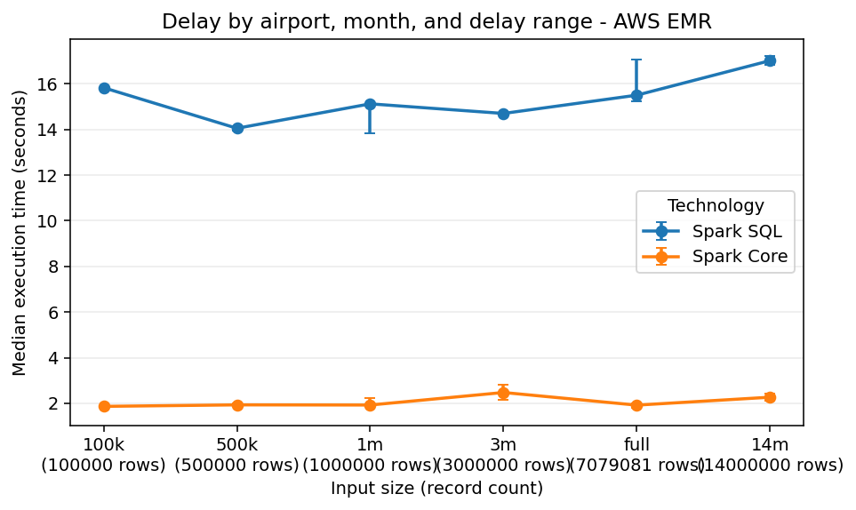
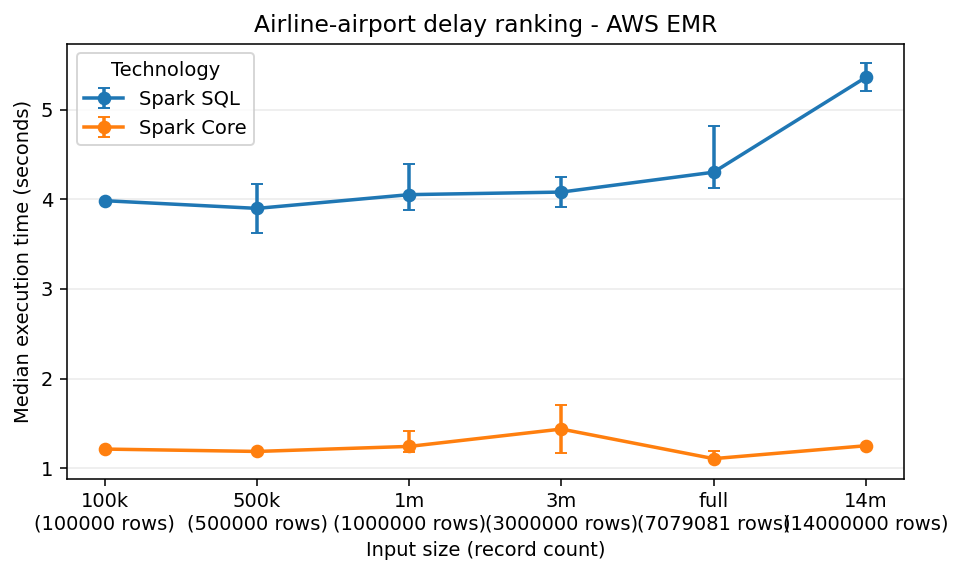
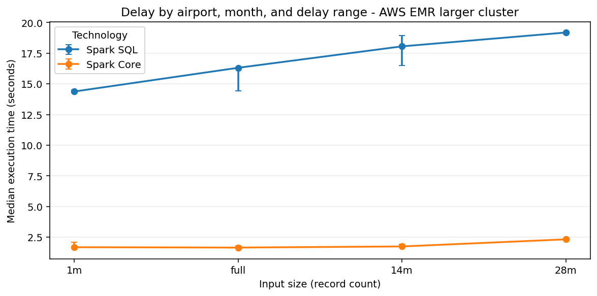
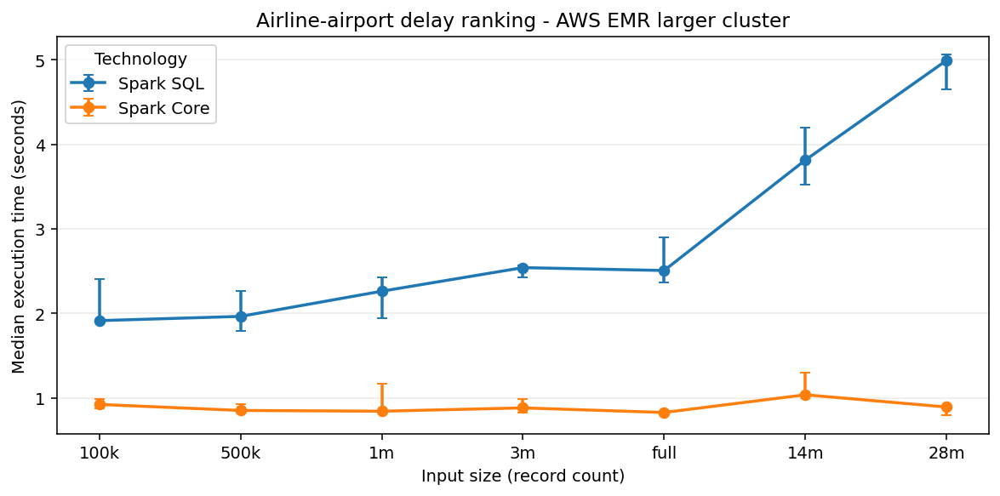

# Executive Summary

This project analyzes the 2024 United States flight delay dataset with a
reproducible big-data workflow. The submitted artifacts show a canonical
cleaned Parquet dataset, two analytical jobs implemented with three required
big-data technologies plus an optional MapReduce stretch, validated outputs,
benchmark evidence, and the tables and figures included in this PDF. The
evidence set includes real Amazon EMR cluster execution in addition to local
execution and Docker standalone simulation, reducing the earlier
scalability-evidence risk while leaving the benchmark limits stated explicitly.

Repository: <https://github.com/Forest904/flight-delay-big-data-analysis.git>

The implemented analyses map directly to the assignment sections:

- **Assignment Analysis 3.2 - Delay Report by Airport and Time Period:**
  delay report by departure airport, month, and departure-delay range.
- **Assignment Analysis 3.3 - Ranking of Airline-Airport Pairs:**
  airline-airport ranking by average departure delay.

The three selected required technologies are Spark SQL, Spark Core RDDs, and
Hive. Spark SQL is used as the correctness reference because its declarative
aggregations and window functions make the required output rules easiest to
review. Spark Core reimplements the same logic with lower-level RDD
transformations. Hive provides the required SQL-on-Hadoop comparison point.
Hadoop Streaming MapReduce is included as a validated stretch extension, kept
separate from the grade-critical default workflow.

The main reproducibility commands are:

```powershell
make setup
make check-env
make prepare
make generate-sizes
make run-spark-sql
make run-spark-core
make run-hive
make run-mapreduce
make benchmark-local
make benchmark-mapreduce-local
make benchmark-docker-simulation
make aws-upload
make benchmark-aws-emr
make aws-fetch-results
make charts
make report
```

The `make benchmark-docker-simulation` target runs single-host Docker standalone
simulation evidence. The AWS targets reproduce the EMR upload, benchmark, and
result-fetch workflow when AWS Academy Learner Lab access and budget are
available; the report uses the completed EMR runs recorded under
`experiments/results/aws-emr/` and `experiments/results/aws-emr-larger/`.

# Assignment Coverage

| Final-report requirement | Where it is answered |
| --- | --- |
| Data preparation operations | Dataset And Preparation |
| Implementation choices and pseudocode | Analyses And Implementations |
| First 10 result rows | Evidence Appendix |
| Execution-time tables and charts | Benchmark Evidence and AWS EMR Cluster Experiment |
| Local, Docker standalone simulation, and AWS EMR settings | Docker Standalone Simulation, Environment And Runtime Configuration, and AWS EMR Cluster Experiment |
| Critical discussion | Critical Discussion |
| GitHub repository link | Executive Summary |

## Requirement-To-Output Mapping

The two selected analyses use stable output schemas so every assignment
requirement can be traced to concrete columns in the generated CSV files and
first-10 report samples.

| Assignment Analysis 3.2 requirement | Output column(s) |
| --- | --- |
| Departure airport | `origin_airport` |
| Month | `month` |
| Departure-delay range | `delay_range` |
| Number of flights | `flight_count` |
| Average departure delay | `avg_departure_delay` |
| Average arrival delay | `avg_arrival_delay` |
| Three most frequent delay or cancellation causes | `top_1_cause`, `top_1_count`, `top_2_cause`, `top_2_count`, `top_3_cause`, `top_3_count` |

| Assignment Analysis 3.3 requirement | Output column(s) |
| --- | --- |
| Departure airport | `origin_airport` |
| Airline | `airline` |
| Number of flights | `flight_count` |
| Average departure delay | `avg_departure_delay` |
| Average arrival delay | `avg_arrival_delay` |
| Cancellation rate | `cancellation_rate` |
| Airport average departure delay | `airport_avg_departure_delay` |
| Difference from airport average | `difference_from_airport_avg_departure_delay` |
| Airline rank at airport | `rank_at_airport` |

The `airline` output field is the normalized `airline_code`. The raw dataset
does not provide a stable airline-name field, so code-based airline identity is
used consistently across Spark SQL, Spark Core, Hive, and the MapReduce
stretch.

# Dataset And Preparation

The source dataset is Kaggle `hrishitpatil/flight-data-2024`, stored locally as
`data/raw/flight_data_2024.csv`. The raw CSV has 7,079,081 rows, 35 columns,
and a local file size of 1,309,010,752 bytes. The raw file is not committed to
Git because it is large and externally hosted.

The preparation pipeline is implemented by `src/preparation/prepare_spark.py`
and is run with:

```powershell
make prepare
```

The prepared output is `data/prepared/flights_2024_clean.parquet`. This Parquet
dataset is the canonical input for Spark SQL, Spark Core, and Hive. MapReduce
uses a canonical CSV export derived from the same prepared Parquet input, not
the raw Kaggle CSV. Using one prepared source keeps the comparison fair: each
implementation receives the same normalized schema, the same row-retention
policy, and the same benchmark input files.

## Canonical Fields

The prepared dataset keeps only the fields needed by the selected analyses:

- Date and grouping: `flight_date`, `month`.
- Airline fields: `airline_code`, plus nullable `airline_name` because the raw
  dataset has no stable airline-name field.
- Airport fields: `origin_airport`, `destination_airport`.
- Delay metrics: `departure_delay`, `arrival_delay`.
- Cancellation and diversion: `cancelled`, `diverted`, `cancellation_code`.
- Delay causes: carrier, weather, NAS, security, and late-aircraft delay
  minutes.

## Cleaning Policy

The cleaning policy is conservative. Rows are removed only when structural
fields are invalid after casting: missing or invalid flight date, month,
airline code, origin airport, destination airport, cancelled flag, or diverted
flag. Cancelled flights, diverted flights, null delay values, and negative
delay values are preserved.

Empty strings are normalized to null. Numeric delay fields are cast to numeric
types but are not imputed. This matters because Spark and Hive averages ignore
null values, while cancellation-rate calculations still need cancelled flights
in the denominator.

The raw data inspection command
`.\.venv\Scripts\python.exe scripts\inspect_raw_dataset.py` found 92,970 null
departure-delay rows and 113,814 null arrival-delay rows. A read-only
cross-count over the same raw CSV found that all 92,970 null departure-delay
rows are cancelled rows with a cancellation code. These rows are retained in
the prepared dataset unless they fail a structural rule. Negative delay values
are preserved because they represent early departures or arrivals, not data
errors.

| Raw audit measure | Rows |
| --- | --- |
| Total raw rows | 7,079,081 |
| Rows with null `departure_delay` / raw `dep_delay` | 92,970 |
| Cancelled rows | 96,315 |
| Cancelled rows with null `departure_delay` | 92,970 |
| Cancelled rows with null `departure_delay` and a cancellation code | 92,970 |

## Generated Input Sizes

The input-size generator creates controlled benchmark inputs under
`data/generated/`:

- `100k`
- `500k`
- `1m`
- `3m`
- `full`
- `14m`
- `28m`

Smaller inputs are selected with a deterministic hash-based method using seed
`20240520`. This avoids chronological bias from simply taking the first rows of
the CSV. The `14m` and `28m` inputs were generated and validated with
controlled replication. The `14m` input uses one complete repetition of the
canonical prepared dataset plus a deterministic sampled remainder of
`6,920,919` rows. The `28m` input uses three complete repetitions plus a
deterministic sampled remainder of `6,762,757` rows. Both outputs keep the same
prepared schema, and no synthetic columns or schema changes are retained.

These replicated larger inputs are used as scalability stress evidence because
they increase data volume while preserving the canonical row shape, column
types, null behavior, and analysis semantics used by the original prepared
dataset. They are not treated as new statistical observations about flight
behavior. In particular, `14m` and `28m` test how the implementations respond
to larger input volume under the controlled benchmark setup.

# Analyses And Implementations

## Assignment Analysis 3.2 - Delay Report by Airport and Time Period

This job implements the assignment requirement to report delay behavior for
each departure airport and time period. In this submission the time period is
the flight month. It groups rows by:

- `origin_airport`
- `month`
- `delay_range`

The delay ranges are:

- `low`: `departure_delay < 15`
- `medium`: `15 <= departure_delay <= 60`
- `high`: `departure_delay > 60`

Rows with null departure delay are excluded from this job because they cannot
be assigned to one of the required ranges. In the raw audit above, that means
92,970 cancelled rows are outside Assignment Analysis 3.2. Their cancellation
codes therefore cannot contribute to the delay-range top-cause counts. The
cause counts in this analysis should be read as causes among flights with a
known departure delay, not as complete cancellation-cause totals for the raw
dataset. For each remaining group, the output reports flight count, average
departure delay, average arrival delay, and the three most frequent delay or
cancellation causes.

The stable output schema includes:

| Field group | Columns |
| --- | --- |
| Grouping keys | `origin_airport`, `month`, `delay_range` |
| Metrics | `flight_count`, `avg_departure_delay`, `avg_arrival_delay` |
| Top causes | `top_1_cause`, `top_1_count`, `top_2_cause`, `top_2_count`, `top_3_cause`, `top_3_count` |

Cause labels are derived from cancellation codes or the largest positive
delay-cause field. Cause ties are deterministic: cause count descending, then
cause label ascending. Groups with fewer than three available causes use an
empty cause value and count `0`.

Textual pseudocode:

```text
filter rows where departure_delay is not null
derive delay_range from departure_delay
derive cause from cancellation code or largest positive delay-cause field
group by origin_airport, month, delay_range
compute flight count and average delays
count causes inside each group
rank causes by count descending and cause label ascending
emit the first three causes and pad missing slots with count 0
order output deterministically
```

## Assignment Analysis 3.3 - Ranking of Airline-Airport Pairs

This job implements the assignment requirement to compare each airline-airport
pair against the airport average. For each `(origin_airport, airline_code)` pair
it computes:

- flight count;
- average departure delay;
- average arrival delay;
- cancellation rate, using all flights in the pair as the denominator,
  including cancelled flights;
- airport average departure delay;
- difference from the airport average;
- rank at the airport, from lowest average departure delay to highest.

Textual pseudocode:

```text
group flights by origin_airport and airline_code
compute airline-level counts, averages, and cancellation rate
group flights by origin_airport
compute airport-level average departure delay
join airline metrics with airport metrics
rank airlines per airport by avg_departure_delay ascending, nulls last
order output by airport, rank, average delay, and airline code
```

## Spark SQL

Spark SQL is the reference implementation. It expresses both analyses with
DataFrame temporary views, SQL aggregations, and window functions. The ranking
job uses `RANK() OVER (PARTITION BY origin_airport ORDER BY
avg_departure_delay ASC NULLS LAST)`. The delay job uses grouped cause counts
and `ROW_NUMBER()` to select the top three causes with deterministic
tie-breaking.

Spark SQL is the most concise implementation in this project. The grouping
keys, derived fields, ranking rule, and top-three cause rule are visible in the
query structure. The cost is that grouped aggregations and window functions
still require shuffles; declarative syntax makes the logic easier to maintain,
but it does not remove distributed execution cost.

Execution plan: `make run-spark-sql` reads the canonical prepared Parquet input
with the Spark settings from `config/local.yaml`, registers a temporary view,
executes one SQL query per analysis, writes full CSV outputs plus first-10
samples under `outputs/spark_sql/`, and records runtime metrics in
`outputs/spark_sql/runtime_metrics.json`. Its outputs are validated directly
and then used as the correctness reference for Spark Core, Hive, and the
MapReduce stretch.

## Spark Core

Spark Core reimplements the Spark SQL logic with RDD transformations. It uses
`reduceByKey` for delay aggregates, cause counts, airline aggregates, and
airport aggregates. This avoids `groupByKey` for large aggregations and allows
partial accumulator state to be combined before the shuffle.

The Spark Core implementation is intentionally explicit. It builds accumulator
objects for counts, sums, cancellation totals, and cause counts; joins compact
aggregate RDDs by airport; and sorts per-airport airline rows to reproduce the
Spark SQL rank semantics. This gives more control over the physical steps but
also makes the implementation more verbose and easier to get wrong.

Execution plan: `make run-spark-core` reads the same prepared Parquet input,
converts rows into RDD records, runs the two analysis pipelines with keyed
aggregations, joins, and deterministic sorts, then materializes the small result
tables to the same CSV contract used by Spark SQL. Runtime metrics are written
under `outputs/spark_core/`, and validation compares Spark Core row counts,
keys, numeric values, top-three causes, and ranking order against Spark SQL.

## Hive

Hive is the third required technology. The runner starts the Docker Compose
Hive stack, creates an external table over the prepared Parquet data, executes
HiveQL versions of both analyses, and exports CSV outputs with the same schemas
as Spark SQL and Spark Core.

Hive is useful as a SQL-on-Hadoop comparison point. Its SQL syntax is familiar
for aggregation-heavy work, but this project runs Hive as a local
containerized HiveServer2/metastore/PostgreSQL stack. The setup does not use a
Hive-on-YARN or HDFS service, so the Hive results should be read as controlled
local/container evidence rather than as managed-service Hive performance.

Execution plan: `make run-hive` starts the local Docker Compose Hive services,
creates an external Hive table over the prepared Parquet directory, runs the
two HiveQL scripts, exports query results through temporary text tables, and
normalizes them into the shared CSV output layout under `outputs/hive/`.
Runtime metrics record per-query duration and output rows. Validation compares
the exported Hive outputs against the Spark SQL reference.

## MapReduce Stretch

Hadoop Streaming MapReduce is implemented as an optional stretch, not as part
of the three required technology baseline. The implementation uses Python
mappers and reducers under `src/mapreduce/`, runs through a Docker-based
`mapreduce-runner` service, and writes the same output schemas under
`outputs/mapreduce/`.

MapReduce reads a canonical CSV export generated from prepared Parquet. The
export is stored under `data/generated/mapreduce_csv/` with a manifest that
records the source Parquet signature, row count, CSV size, CSV SHA-256, and
export duration. This keeps the stretch comparison fair without reparsing the
raw Kaggle CSV, while avoiding stale cached exports.

The delay reducer computes the same grouped counts, averages, and top-three
cause ordering as Spark SQL. The ranking reducer groups by airport, aggregates
airline statistics, computes the airport average departure delay, and applies
Spark SQL `RANK()` semantics with null averages last. Validation passed against
Spark SQL for the full prepared dataset; the separate benchmark campaign uses
the `100k`, `500k`, `1m`, `3m`, and `full` inputs as optional stretch evidence.

The supported runtime is Docker-local Hadoop Streaming, not YARN/HDFS.
MapReduce benchmark runs use isolated output roots under
`outputs/mapreduce/.benchmark_runs/`, leaving `outputs/mapreduce/` reserved for
validated report-ready outputs.

Execution plan: `make run-mapreduce` exports the selected prepared Parquet input
to a canonical CSV with a manifest, runs Hadoop Streaming mapper/reducer jobs
inside the Docker-local runtime, sorts and normalizes reducer output into the
shared CSV schemas, and records runtime metrics under `outputs/mapreduce/`.
The validator compares the stretch outputs against Spark SQL before the report
uses them as evidence.

# Docker Standalone Simulation

The Docker standalone simulation is the repository's controlled alternative
execution setting. Spark uses Docker Compose with one Spark standalone master,
two Spark workers, and a driver service. The workers are separate containers
and processes, but they all run on one physical laptop and share Docker Desktop
CPU, memory, and disk limits. Data is read from a bind-mounted project
directory, not HDFS or object storage. This is not a true distributed cluster;
it is a repeatable single-host simulation of Spark standalone execution.

Hive is included in the Docker benchmark CSV so the report contains rows for
all three required technologies, but Hive remains a single-node containerized
Hive setup. Therefore the report uses the phrase "Docker standalone simulation"
and avoids presenting these runs as managed-service performance.

The documented topology is stored in `docs/docker_simulation.md`. The command
used to run the simulation evidence is:

```powershell
make benchmark-docker-simulation
```

# Environment And Runtime Configuration

The environment summary was generated by `scripts/generate_environment_summary.py`.
The complete artifact is stored at `report/tables/environment_summary.md`.

| Category | Item | Value |
| --- | --- | --- |
| Host OS | Windows detail | Microsoft Windows 11 Home 10.0.26200 build 26200 64-bit |
| CPU | Model | AMD Ryzen AI 7 350 w/ Radeon 860M |
| CPU | Cores | 8 physical, 16 logical |
| Memory | Host RAM | 33,598,853,120 bytes |
| Disk | Project drive | NVMe SSD, 1,024,209,543,168 bytes |
| Python | Version | 3.12.2 |
| Java | Version | OpenJDK 17.0.19 |
| PySpark | Version | 4.1.1 |
| Hive | Base image | `apache/hive:4.0.1` |
| MapReduce | Base image | `apache/hive:4.0.1` with Hadoop Streaming and Python 3 |
| Docker | Version | 29.4.3 |
| Docker Compose | Version | v5.1.3 |
| Docker Desktop | Limits | 16 CPUs, 16,391,536,640 memory bytes |
| Local Spark | Master and partitions | `local[*]`, 8 shuffle partitions |
| Docker Spark | Master and partitions | `spark://spark-master:7077`, 16 shuffle partitions |
| Docker topology | Spark | 1 master, 2 workers, 2 cores and 2 GB memory per worker |
| Docker topology | Hive | HiveServer2, metastore, PostgreSQL, single host |

# Benchmark Evidence

The benchmark runner records technology, job name, input size, environment,
execution-setting label, repetition number, raw duration, output rows, status,
timestamp, input path, and metrics path. By default, each selected
input/technology configuration is run three times. Timestamped benchmark CSVs
remain raw audit evidence, while the report-ready artifacts under
`report/tables/` and `report/figures/` aggregate successful repetitions.

The reporting pipeline computes median, mean, minimum, maximum, and standard
deviation of duration for each environment/input/job/technology group.
`report/tables/benchmark_summary.md` is the detailed execution-time table: it
shows `runs`, median, mean, min, max, standard deviation, output rows, run ID,
and timestamp. Single-run CSVs are still readable as `runs=1`, and fresh
benchmark campaigns can be forced to one run for smoke checks with
`BENCHMARK_FLAGS="--repetitions 1"`. A `runs=1` row is not treated as
statistically equivalent to a repeated campaign; `report/tables/benchmark_notes.csv`
marks those cells as `smoke`, `budget_limited`, or `resource_limited`.

The benchmark duration column is the per-analysis job duration reported by the
technology runner after the input has been prepared. It covers the analysis
execution and output materialization, but it does not include the one-time data
preparation pipeline. Some fixed costs still shape interpretation: Spark/JVM
startup, Docker container and service startup, Hive service startup, query
planning, local file listing, S3 I/O, and EMR step scheduling can dominate the
shorter runs or appear in surrounding step/command timing artifacts rather than
inside the per-job aggregate alone. Local and Docker runs read prepared Parquet
from a warm local filesystem or bind mount, so OS cache and columnar Parquet
reads affect the observed throughput. EMR runs read and write through S3 and
are scheduled as managed Spark steps, so object-store and scheduler overhead
are part of the managed execution path.

The opt-in MapReduce stretch benchmark is reported separately from the required
default benchmark matrix:

| Environment | Inputs | Technologies | Jobs | Status |
| --- | --- | --- | --- | --- |
| Local | `100k`, `500k`, `1m`, `3m`, `full`, `14m`, `28m` | Spark SQL, Spark Core, Hive | both jobs | 42/42 successful, 3 repetitions each |
| Docker standalone simulation | `100k`, `500k`, `1m` | Spark SQL, Spark Core, Hive | both jobs | 18/18 successful |
| AWS EMR baseline cluster | `100k`, `500k`, `1m`, `3m`, `full`, `14m` | Spark SQL, Spark Core | both jobs | 24/24 successful |
| AWS EMR larger cluster | `1m`, `full` | Spark SQL, Spark Core | both jobs | 8/8 successful |
| Local stretch | `100k`, `500k`, `1m`, `3m`, `full` | Hadoop Streaming MapReduce | both jobs | 10/10 successful, 3 repetitions each |

The local required-technology run IDs are `20260522T133525179005Z`,
`20260522T142052973274Z`, and `20260522T144129099690Z`. The Docker standalone
simulation run ID is `20260522T161751426398Z`. The MapReduce stretch benchmark
run ID is `20260522T182250129354Z`. The canonical AWS EMR baseline run ID is
`m4-emr-final-2`, the AWS 100k hardened path is marked as smoke evidence under
`m4-hardened-smoke-3`, and the limited larger-cluster comparison run ID is
`m5-emr-3core-1m-full`. AWS uses three repetitions for `1m` and `full`, one
budget-limited run for `500k`, `3m`, and `14m`, and a separate smoke record for
the `100k` audit path. The full status matrix is stored in
`report/tables/benchmark_status.md`; cells that were not run remain explicit
`N/A` or `not_run` entries rather than inferred values.

The table below is a compact excerpt from `report/tables/benchmark_summary.md`.
The full generated table contains the same statistics for every successful
environment/input/job/technology group.

| Evidence row | runs | median s | mean s | min s | max s | stddev s | note |
| --- | ---: | ---: | ---: | ---: | ---: | ---: | --- |
| Local `28m` delay, Spark SQL | 3 | 11.924 | 11.896 | 11.790 | 11.973 | 0.095 | Replicated stress input |
| Local `28m` delay, Spark Core | 3 | 1.333 | 1.403 | 1.252 | 1.625 | 0.196 | Replicated stress input |
| Local `28m` delay, Hive | 3 | 101.265 | 101.785 | 100.484 | 103.605 | 1.624 | Replicated stress input |
| Docker `1m` delay, Spark SQL | 3 | 14.541 | 14.559 | 14.242 | 14.895 | 0.327 | Docker standalone simulation |
| AWS EMR `14m` delay, Spark SQL | 1 | 18.147 | 18.147 | 18.147 | 18.147 | N/A | Budget-limited single run |
| AWS EMR `100k` delay, Spark SQL | 1 | 15.832 | 15.832 | 15.832 | 15.832 | N/A | Smoke evidence |

## Benchmark Pivot

For compactness, `report/tables/benchmark_pivot.md` focuses on median duration
by technology. It is useful for scanning, but the benchmark-summary table above
is the statistical source because it carries run counts, variability, and
single-run context. The pivot intentionally leaves unavailable technology/input
combinations blank or `N/A` rather than extrapolating them.

## Rows Per Second

Rows-per-second values in `report/tables/rows_per_second.md` are computed as
input records divided by median elapsed seconds. Throughput appears higher
under several larger-input local and Docker cells, but fixed costs, caching,
prepared Parquet columnar reads, and small aggregate output cardinality affect
interpretation. The replicated `14m` and `28m` rows are therefore stress tests
of the execution setup, not new flight-behavior observations.

## Speedup Ratios

Each value in `report/tables/speedup.md` is a median-duration ratio. A value
above `1` means the numerator took longer than the denominator for the
aggregate row. These ratios are descriptive for the measured setup and are not
portable performance constants.

## Normalized Scalability

`report/tables/scalability_ratios.md` normalizes median duration, record count,
and throughput against the `100k` baseline for each environment, job, and
technology. The ratios help describe where throughput appears higher under the
measured setup, but fixed startup costs, cache behavior, shuffle and aggregation
pressure, and the small result cardinality limit what can be inferred from
them.

## Benchmark Charts

Execution-time charts are generated separately for local execution, Docker
standalone simulation, AWS EMR baseline, and AWS EMR larger-cluster runs. Charts
plot median duration and include min/max variability indicators when repeated
successful measurements are available. Line plots are used only when at least
three input sizes are available for a job and environment.










# AWS EMR Cluster Experiment

The project includes real Amazon EMR evidence in addition to local and Docker
standalone simulation runs. The AWS lane uses Spark steps on YARN, S3 for input
and output movement, and short-lived clusters created specifically for
benchmark evidence. Amazon's EMR Spark documentation and the EMR 7.13.0
release notes list Spark `3.5.6-amzn-2` for release `emr-7.13.0`:
<https://docs.aws.amazon.com/emr/latest/ReleaseGuide/emr-spark.html> and
<https://docs.aws.amazon.com/emr/latest/ReleaseGuide/emr-7130-release.html>.

| Field | Baseline EMR run | Larger EMR run |
| --- | --- | --- |
| Run ID | `m4-emr-final-2` | `m5-emr-3core-1m-full` |
| Cluster ID | `j-VS6OEAAXUMGP` | `j-LTX1FIHYB4X9` |
| Region | `us-east-1` | `us-east-1` |
| EMR release | `emr-7.13.0` | `emr-7.13.0` |
| Spark version | `3.5.6-amzn-2` | `3.5.6-amzn-2` |
| Execution mode | Spark steps on YARN | Spark steps on YARN |
| Instance type | `m5.xlarge` | `m5.xlarge` |
| Node counts | 1 primary + 2 core, 3 total | 1 primary + 3 core, 4 total |
| Inputs | `100k`, `500k`, `1m`, `3m`, `full`, `14m` | `1m`, `full` |
| Technologies | Spark SQL, Spark Core | Spark SQL, Spark Core |
| Cluster lifetime | `2026-05-21T22:51:56Z` to `2026-05-21T23:40:53Z` | `2026-05-22T00:46:03Z` to `2026-05-22T01:12:14Z` |
| Cost evidence | Approximately `0.5530 USD`, estimated from run timestamps and config | `0.3944 USD` in `aws_cost_log` |

The S3 layout is deliberately simple and reproducible:

| Prefix | Purpose |
| --- | --- |
| `s3://fd-bda-380623119505-us-east-1/flight-delay/data/` | Prepared and generated Parquet inputs |
| `s3://fd-bda-380623119505-us-east-1/flight-delay/code/` | Source bundles and per-run runtime configs |
| `s3://fd-bda-380623119505-us-east-1/flight-delay/results/` | Runtime metrics, benchmark outputs, and fetched result evidence |
| `s3://fd-bda-380623119505-us-east-1/flight-delay/logs/` | EMR and Spark step logs |

The report-ready AWS evidence is generated into small audit artifacts instead
of relying on console screenshots. `report/tables/aws_run_manifest.md` records
cluster IDs, region, EMR release, instance type, node count, source-bundle hash,
runtime-config hash, and dependency pins where available.
`report/tables/aws_step_timing.md` records EMR step queue/start/end timings and
S3 metrics URIs. `report/tables/aws_cost_log.md` records cluster lifetime,
node-hours, configured hourly cost estimates, and Learner Lab budget fields.
The aggregate timings flow into `report/tables/benchmark_summary.md`, and the
local/Docker/EMR size comparison is summarized in
`report/tables/cluster_size_comparison.md`.

Cost controls were built into the workflow before running the expensive steps:
the AWS config targets the AWS Academy Learner Lab budget, uses short-lived
clusters, validates S3 input prefixes before cluster creation, sets cluster
startup, step, and total-run timeouts, enables a 600-second idle termination
policy for the hardened/larger runs, terminates the tracked cluster in the
benchmark helper, and exposes `make aws-cleanup` for tagged-cluster cleanup.
This makes the AWS results reproducible while avoiding any claim that the
experiment was an unconstrained production benchmark.

## Cluster Size Variation

The cluster-size comparison uses `m4-emr-final-2` as the baseline point and
`m5-emr-3core-1m-full` as the larger-cluster point. The larger run used one
primary node and three core nodes, the same `m5.xlarge` instance type, the same
EMR release, and the same Spark/YARN execution path. It completed on cluster
`j-LTX1FIHYB4X9` from `2026-05-22T00:46:03Z` to `2026-05-22T01:12:14Z`, with
an estimated cost of `0.3944 USD`. The larger-profile matrix was intentionally
limited to `1m` and `full` so the evidence stayed within AWS Academy Learner
Lab budget limits. Docker standalone simulation is shown only where matching
data exists; the Docker benchmark matrix stops at `1m`, so Docker `full` cells
are marked `N/A` instead of being overclaimed.

The generated cluster-size comparison table is stored in
`report/tables/cluster_size_comparison.md`. Compared with the baseline EMR
profile, the larger profile had lower Spark Core medians in all four comparable
cells, with measured speedup ratios from `1.146x` to `1.221x`. Spark SQL was
mixed: it had a lower median for the `1m` delay job (`1.052x`) but higher
medians for `1m` ranking, `full` delay, and `full` ranking (`0.951x` to
`0.991x`). This is limited scalability evidence rather than a general speedup
claim: adding one core node did not uniformly accelerate these short analytical
jobs, and fixed Spark startup, S3 file listing and reads, shuffle planning, and
small output cardinality remain large parts of the measured runtime. The
interpretation is further limited because clusters are short-lived, S3 I/O is
part of the managed execution path, repetitions are constrained by budget, and
Learner Lab service limits prevent wider cluster-size sweeps.

# Critical Discussion

Spark SQL is the most expressive implementation. It is especially strong for
the two selected analyses because both are naturally relational: they derive
columns, group by keys, aggregate measures, and rank rows inside partitions.
Window functions make the airline ranking and top-three cause selection clear.
The tradeoff is that the physical plan still has to shuffle data for grouped
aggregations and window partitions. Spark SQL hides some mechanics, but it does
not make those costs disappear.

Spark Core is the most explicit implementation. The RDD version exposes every
map, key construction, accumulator merge, join, and sort. Its accumulator
design is useful because it combines counts and sums before the shuffle and
keeps the top-three cause logic deterministic. That explicitness also makes the
code more verbose. Reproducing SQL ranking semantics, null handling, and
top-three padding requires careful manual logic that Spark SQL expresses more
directly.

Hive provides SQL-on-Hadoop style expressiveness, but it has the highest
overhead in this project. The containerized Hive stack pays service, query
startup, metastore, and export costs that are visible in the benchmark rows.
Hive remains useful as a third technology and as a contrast with Spark, but the
current local container setup does not demonstrate the strengths of a managed
Hive service.

MapReduce is the most manual implementation. Hadoop Streaming makes the map
and reduce boundaries explicit, and the Python reducers show the accumulator
state required for averages, ranks, and top-three causes. The tradeoff is extra
orchestration: prepared Parquet must be exported to canonical CSV, jobs must be
run through Hadoop Streaming, and reducer output must be normalized back into
the common CSV contract. This makes MapReduce valuable as a stretch comparison,
but less ergonomic than Spark SQL for these analyses.

The delay-by-airport-month job is generally more expensive than the
airline-airport ranking. It derives delay ranges, maps cancellation or delay
causes, counts causes inside each airport-month-range group, and ranks causes
to emit three positions. These steps increase shuffle and aggregation pressure.
The ranking job also performs grouped aggregation and per-airport ranking, but
after the first aggregation it works with compact airport-airline summaries.

Data preparation affects both correctness and benchmark fairness. Correctness is
easier to audit because each technology reads the same typed Parquet schema
instead of reimplementing raw CSV parsing. Benchmark fairness is stronger
because all technologies operate on the same generated inputs. The limitation is
that
preparation cost is not included in the per-job execution-time tables; it is a
separate mandatory pipeline stage documented in this report.

Small input sizes can distort runtime comparisons. JVM startup, Spark session
startup, Docker container/service setup, Hive query startup, file listing, and
query planning are fixed costs. Reads from prepared Parquet can also benefit
from compact columnar layout and operating-system cache effects, while both
analyses emit relatively small aggregate outputs compared with the input size.
At `100k`, these effects can dominate elapsed time; at larger sizes, throughput
may improve even when raw seconds are flat or non-monotonic. The workflow
therefore reports median duration and aggregate timing statistics when repeated
runs are available, while preserving raw per-repetition CSV rows for audit.

The local, Docker, and EMR environments answer different questions. Local
execution is the fastest in many cells because it avoids S3 reads, EMR step
queueing, YARN container startup, and remote cluster coordination; it also runs
near a warm local filesystem on a single tuned development machine. Docker
standalone simulation adds service and container overhead and demonstrates a
repeatable Spark standalone topology, but all workers still share one physical
host. EMR is slower for several short jobs, especially Spark SQL delay
aggregation, but it shows that the same analyses ran as managed Spark steps on
real EC2-backed EMR clusters, read and wrote through S3, emitted logs and
metrics to S3, and produced comparable outputs and benchmark rows. The larger
EMR profile is intentionally treated as limited scalability evidence, not a
universal speedup claim: adding one core node had lower Spark Core medians in
the matched `1m` and `full` cells, while Spark SQL was mixed because fixed
Spark, S3, and scheduling costs remained a large share of these short
analytical workloads.

# Reproducibility And Validation

Generated large data, raw data, and full output directories are ignored by Git.
The repository commits only small evaluator-facing evidence: report tables,
figures, source code, documentation, and scripts.

Correctness validation is available through:

```powershell
.\.venv\Scripts\python.exe scripts\validate_spark_sql_outputs.py
.\.venv\Scripts\python.exe scripts\validate_spark_core_outputs.py
.\.venv\Scripts\python.exe scripts\validate_hive_outputs.py
.\.venv\Scripts\python.exe scripts\validate_mapreduce_outputs.py
```

Spark Core, Hive, and MapReduce validators compare their outputs against Spark
SQL, including output columns, row counts, key sets, numeric values within
tolerance, top-three cause labels and counts, ranking order, and first-10
sample files.

# Limitations

- The raw dataset and generated benchmark inputs are not committed to Git
  because they are large.
- The raw dataset does not include airline names, so analyses use
  `airline_code`.
- MapReduce depends on Docker-based Hadoop Streaming and is kept outside the
  default `make run-all-local` and `make benchmark-local` paths.
- The Docker Spark setup is a Docker standalone simulation on one physical
  machine, not a true distributed cluster.
- The Docker benchmark matrix stops at `1m`; Docker `full` comparison cells are
  marked `N/A` rather than inferred.
- Hive is containerized locally and is not running on a Hadoop/YARN service.
- Docker worker-count variation is not included because the reliable Docker
  Compose topology has two named Spark workers.
- AWS evidence was produced inside AWS Academy Learner Lab, so service
  availability, IAM roles, instance availability, and the budget allowance were
  more constrained than a normal AWS account.
- EMR clusters were intentionally short-lived and benchmark-scoped. This is
  good for budget control but means the report does not measure long-running
  cluster warmup, autoscaling, or production scheduling behavior.
- S3 I/O is part of the EMR path. EMR timings therefore include object-store
  listing/read/write effects that local and Docker bind-mounted runs avoid.
- The Learner Lab budget was small, so the larger-cluster experiment was
  limited to `1m` and `full` inputs instead of repeating the entire AWS matrix.
- The largest AWS inputs have limited repetitions: `14m`, `3m`, and `500k` were
  run once in the baseline EMR matrix, while `1m` and `full` were repeated three
  times for the baseline and larger profiles.
- Windows Spark runs require care around Java, Hadoop `winutils.exe`, and
  native file handling; the project includes compatibility helpers and Docker
  paths where needed.
- Benchmark results are hardware-dependent and should be interpreted as
  evidence for this controlled environment, not universal performance numbers.

# Conclusion

The submitted artifacts show the main assignment work: a reproducible data
preparation pipeline, Assignment Analyses 3.2 and 3.3, three technology
implementations, first-10 result samples for each job and technology, benchmark
tables, execution-time charts, and a critical discussion of expressiveness,
implementation effort, efficiency, scalability, shuffle, aggregation, and data
preparation effects. Spark SQL provides the clearest reference logic, Spark Core
demonstrates lower-level distributed transformation control, and Hive provides
the required SQL-on-Hadoop comparison point. The completed MapReduce stretch
adds a fourth validated implementation and shows the extra mechanics needed
when using Hadoop Streaming directly.

The final submission also includes real cluster evidence: Spark SQL and Spark
Core ran on Amazon EMR `emr-7.13.0` clusters in `us-east-1`, with S3 inputs,
logs, metrics, fetched outputs, run manifests, step timing, and cost logs. This
reduces the earlier weakness that the project only had local and Docker
standalone simulation evidence, with the following limits: AWS Learner Lab
budget and service constraints limited the number of repetitions, input sizes
for the larger cluster, and breadth of cluster-size variation.

# Evidence Appendix: First 10 Result Rows

The tables below embed the first 10 rows generated for Assignment Analysis 3.2
and Assignment Analysis 3.3 across the three required technologies. Wide
outputs are split into paired narrow tables so the PDF remains readable. The
source artifacts are stored under `report/tables/` and are regenerated by
`make charts`. MapReduce stretch sample artifacts are generated with the same
naming convention and summarized after the required-technology samples.

## Spark SQL Samples

### Delay Metrics

| Origin | Mo. | Range | Flights | Avg dep. | Avg arr. |
| --- | --- | --- | --- | --- | --- |
| ABE | 1 | high | 8 | 231.5 | 221.375 |
| ABE | 1 | low | 35 | -6.286 | -19.629 |
| ABE | 1 | medium | 4 | 32.75 | 31.25 |
| ABE | 2 | high | 3 | 324 | 335.667 |
| ABE | 2 | low | 40 | -8.5 | -23.575 |
| ABE | 2 | medium | 4 | 45.5 | 29.333 |
| ABE | 3 | high | 8 | 127 | 121.625 |
| ABE | 3 | low | 41 | -4.756 | -16.39 |
| ABE | 3 | medium | 3 | 32.333 | 12.667 |
| ABE | 4 | high | 6 | 158.333 | 150.333 |

### Delay Top-Three Causes

| Origin | Mo. | Range | Top 1 | Top 2 | Top 3 |
| --- | --- | --- | --- | --- | --- |
| ABE | 1 | high | delay:carrier (3) | delay:late_aircraft (3) | delay:nas (2) |
| ABE | 1 | low | unknown (34) | delay:nas (1) | none (0) |
| ABE | 1 | medium | delay:late_aircraft (2) | delay:carrier (1) | delay:nas (1) |
| ABE | 2 | high | delay:late_aircraft (1) | delay:nas (1) | delay:weather (1) |
| ABE | 2 | low | unknown (39) | delay:nas (1) | none (0) |

| Origin | Mo. | Range | Top 1 | Top 2 | Top 3 |
| --- | --- | --- | --- | --- | --- |
| ABE | 2 | medium | unknown (2) | delay:carrier (1) | delay:late_aircraft (1) |
| ABE | 3 | high | delay:carrier (3) | delay:late_aircraft (3) | delay:nas (2) |
| ABE | 3 | low | unknown (40) | delay:nas (1) | none (0) |
| ABE | 3 | medium | unknown (2) | delay:carrier (1) | none (0) |
| ABE | 4 | high | delay:carrier (4) | delay:late_aircraft (2) | none (0) |

### Ranking Metrics

| Origin | Airline | Flights | Avg dep. | Avg arr. | Cancel rate |
| --- | --- | --- | --- | --- | --- |
| ABE | 9E | 140 | 10.234 | 0.445 | 0.021 |
| ABE | G4 | 260 | 12.463 | 4.337 | 0.012 |
| ABE | OH | 159 | 19.38 | 6.867 | 0.006 |
| ABE | OO | 40 | 25.297 | 14.389 | 0.075 |
| ABI | MQ | 249 | 6.664 | 4.405 | 0.008 |
| ABQ | DL | 218 | 1.383 | -5.15 | 0.018 |
| ABQ | OO | 547 | 3.617 | -0.855 | 0.004 |
| ABQ | UA | 273 | 4.584 | -1.477 | 0.022 |
| ABQ | MQ | 127 | 7.134 | 5.575 | 0 |
| ABQ | AS | 67 | 7.522 | 1.881 | 0 |

### Ranking Comparison

| Origin | Airline | Airport avg dep. | Diff vs airport | Rank |
| --- | --- | --- | --- | --- |
| ABE | 9E | 14.606 | -4.373 | 1 |
| ABE | G4 | 14.606 | -2.143 | 2 |
| ABE | OH | 14.606 | 4.774 | 3 |
| ABE | OO | 14.606 | 10.691 | 4 |
| ABI | MQ | 6.664 | 0 | 1 |
| ABQ | DL | 8.792 | -7.409 | 1 |
| ABQ | OO | 8.792 | -5.176 | 2 |
| ABQ | UA | 8.792 | -4.208 | 3 |
| ABQ | MQ | 8.792 | -1.659 | 4 |
| ABQ | AS | 8.792 | -1.27 | 5 |

## Spark Core Samples

### Delay Metrics

| Origin | Mo. | Range | Flights | Avg dep. | Avg arr. |
| --- | --- | --- | --- | --- | --- |
| ABE | 1 | high | 8 | 231.5 | 221.375 |
| ABE | 1 | low | 35 | -6.286 | -19.629 |
| ABE | 1 | medium | 4 | 32.75 | 31.25 |
| ABE | 2 | high | 3 | 324 | 335.667 |
| ABE | 2 | low | 40 | -8.5 | -23.575 |
| ABE | 2 | medium | 4 | 45.5 | 29.333 |
| ABE | 3 | high | 8 | 127 | 121.625 |
| ABE | 3 | low | 41 | -4.756 | -16.39 |
| ABE | 3 | medium | 3 | 32.333 | 12.667 |
| ABE | 4 | high | 6 | 158.333 | 150.333 |

### Delay Top-Three Causes

| Origin | Mo. | Range | Top 1 | Top 2 | Top 3 |
| --- | --- | --- | --- | --- | --- |
| ABE | 1 | high | delay:carrier (3) | delay:late_aircraft (3) | delay:nas (2) |
| ABE | 1 | low | unknown (34) | delay:nas (1) | none (0) |
| ABE | 1 | medium | delay:late_aircraft (2) | delay:carrier (1) | delay:nas (1) |
| ABE | 2 | high | delay:late_aircraft (1) | delay:nas (1) | delay:weather (1) |
| ABE | 2 | low | unknown (39) | delay:nas (1) | none (0) |
| ABE | 2 | medium | unknown (2) | delay:carrier (1) | delay:late_aircraft (1) |
| ABE | 3 | high | delay:carrier (3) | delay:late_aircraft (3) | delay:nas (2) |
| ABE | 3 | low | unknown (40) | delay:nas (1) | none (0) |
| ABE | 3 | medium | unknown (2) | delay:carrier (1) | none (0) |
| ABE | 4 | high | delay:carrier (4) | delay:late_aircraft (2) | none (0) |

### Ranking Metrics

| Origin | Airline | Flights | Avg dep. | Avg arr. | Cancel rate |
| --- | --- | --- | --- | --- | --- |
| ABE | 9E | 140 | 10.234 | 0.445 | 0.021 |
| ABE | G4 | 260 | 12.463 | 4.337 | 0.012 |
| ABE | OH | 159 | 19.38 | 6.867 | 0.006 |
| ABE | OO | 40 | 25.297 | 14.389 | 0.075 |
| ABI | MQ | 249 | 6.664 | 4.405 | 0.008 |
| ABQ | DL | 218 | 1.383 | -5.15 | 0.018 |
| ABQ | OO | 547 | 3.617 | -0.855 | 0.004 |
| ABQ | UA | 273 | 4.584 | -1.477 | 0.022 |
| ABQ | MQ | 127 | 7.134 | 5.575 | 0 |
| ABQ | AS | 67 | 7.522 | 1.881 | 0 |

### Ranking Comparison

| Origin | Airline | Airport avg dep. | Diff vs airport | Rank |
| --- | --- | --- | --- | --- |
| ABE | 9E | 14.606 | -4.373 | 1 |
| ABE | G4 | 14.606 | -2.143 | 2 |
| ABE | OH | 14.606 | 4.774 | 3 |
| ABE | OO | 14.606 | 10.691 | 4 |
| ABI | MQ | 6.664 | 0 | 1 |
| ABQ | DL | 8.792 | -7.409 | 1 |
| ABQ | OO | 8.792 | -5.176 | 2 |
| ABQ | UA | 8.792 | -4.208 | 3 |
| ABQ | MQ | 8.792 | -1.659 | 4 |
| ABQ | AS | 8.792 | -1.27 | 5 |

## Hive Samples

### Delay Metrics

| Origin | Mo. | Range | Flights | Avg dep. | Avg arr. |
| --- | --- | --- | --- | --- | --- |
| ABE | 1 | high | 8 | 231.5 | 221.375 |
| ABE | 1 | low | 35 | -6.286 | -19.629 |
| ABE | 1 | medium | 4 | 32.75 | 31.25 |
| ABE | 2 | high | 3 | 324 | 335.667 |
| ABE | 2 | low | 40 | -8.5 | -23.575 |
| ABE | 2 | medium | 4 | 45.5 | 29.333 |
| ABE | 3 | high | 8 | 127 | 121.625 |
| ABE | 3 | low | 41 | -4.756 | -16.39 |
| ABE | 3 | medium | 3 | 32.333 | 12.667 |
| ABE | 4 | high | 6 | 158.333 | 150.333 |

### Delay Top-Three Causes

| Origin | Mo. | Range | Top 1 | Top 2 | Top 3 |
| --- | --- | --- | --- | --- | --- |
| ABE | 1 | high | delay:carrier (3) | delay:late_aircraft (3) | delay:nas (2) |
| ABE | 1 | low | unknown (34) | delay:nas (1) | none (0) |
| ABE | 1 | medium | delay:late_aircraft (2) | delay:carrier (1) | delay:nas (1) |
| ABE | 2 | high | delay:late_aircraft (1) | delay:nas (1) | delay:weather (1) |
| ABE | 2 | low | unknown (39) | delay:nas (1) | none (0) |

| Origin | Mo. | Range | Top 1 | Top 2 | Top 3 |
| --- | --- | --- | --- | --- | --- |
| ABE | 2 | medium | unknown (2) | delay:carrier (1) | delay:late_aircraft (1) |
| ABE | 3 | high | delay:carrier (3) | delay:late_aircraft (3) | delay:nas (2) |
| ABE | 3 | low | unknown (40) | delay:nas (1) | none (0) |
| ABE | 3 | medium | unknown (2) | delay:carrier (1) | none (0) |
| ABE | 4 | high | delay:carrier (4) | delay:late_aircraft (2) | none (0) |

### Ranking Metrics

| Origin | Airline | Flights | Avg dep. | Avg arr. | Cancel rate |
| --- | --- | --- | --- | --- | --- |
| ABE | 9E | 140 | 10.234 | 0.445 | 0.021 |
| ABE | G4 | 260 | 12.463 | 4.337 | 0.012 |
| ABE | OH | 159 | 19.38 | 6.867 | 0.006 |
| ABE | OO | 40 | 25.297 | 14.389 | 0.075 |
| ABI | MQ | 249 | 6.664 | 4.405 | 0.008 |
| ABQ | DL | 218 | 1.383 | -5.15 | 0.018 |
| ABQ | OO | 547 | 3.617 | -0.855 | 0.004 |
| ABQ | UA | 273 | 4.584 | -1.477 | 0.022 |
| ABQ | MQ | 127 | 7.134 | 5.575 | 0 |
| ABQ | AS | 67 | 7.522 | 1.881 | 0 |

### Ranking Comparison

| Origin | Airline | Airport avg dep. | Diff vs airport | Rank |
| --- | --- | --- | --- | --- |
| ABE | 9E | 14.606 | -4.373 | 1 |
| ABE | G4 | 14.606 | -2.143 | 2 |
| ABE | OH | 14.606 | 4.774 | 3 |
| ABE | OO | 14.606 | 10.691 | 4 |
| ABI | MQ | 6.664 | 0 | 1 |
| ABQ | DL | 8.792 | -7.409 | 1 |
| ABQ | OO | 8.792 | -5.176 | 2 |
| ABQ | UA | 8.792 | -4.208 | 3 |
| ABQ | MQ | 8.792 | -1.659 | 4 |
| ABQ | AS | 8.792 | -1.27 | 5 |

## MapReduce Stretch Samples

The MapReduce stretch implements both selected analyses with Hadoop Streaming.
It is optional evidence after the required Spark SQL, Spark Core, and Hive
samples above. The validated full prepared-data run produced 11,902
delay rows and 1,738 ranking rows, matching the Spark SQL reference on keys,
numeric fields, rank values, and top-three cause labels/counts.

| Artifact | Path |
| --- | --- |
| Runtime metrics | `outputs/mapreduce/runtime_metrics.json` |
| Delay sample | `report/tables/first_10_mapreduce_delay_by_airport_month.md` |
| Ranking sample | `report/tables/first_10_mapreduce_airline_airport_ranking.md` |
| Validator | `scripts/validate_mapreduce_outputs.py` |
| Runtime documentation | `docs/mapreduce_analyses.md` |

The MapReduce stretch benchmark completed `100k`, `500k`, `1m`, `3m`, and
`full` inputs with three repetitions per input/job using isolated benchmark
outputs. These rows are included in generated report tables when present, but
missing MapReduce cells are not added to the required Spark/Hive/Spark Core
benchmark status matrix.
