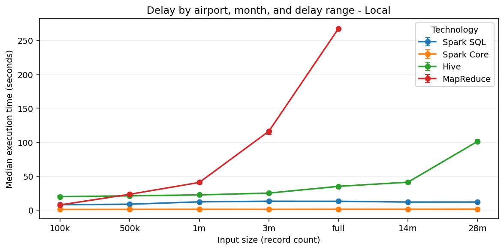
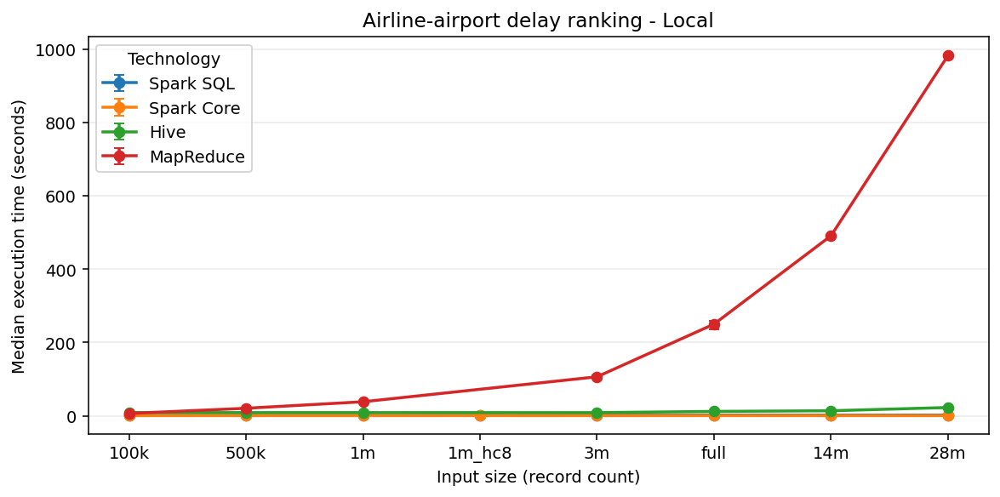
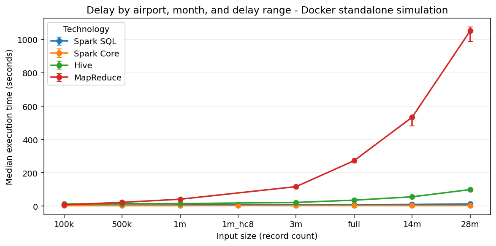
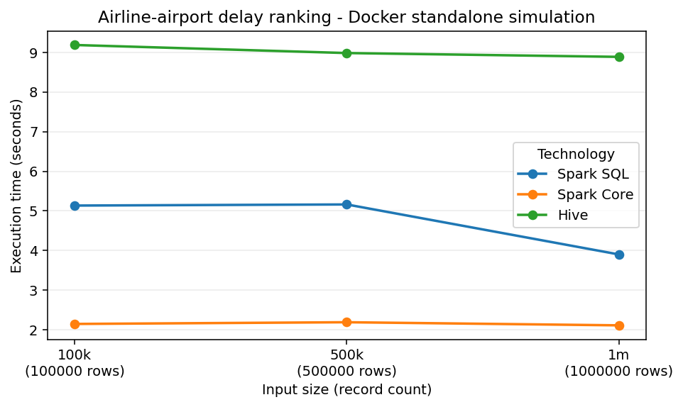

# Executive Summary

This project analyzes the 2024 United States flight delay dataset with a
reproducible big-data workflow. The repository prepares a canonical cleaned
Parquet dataset, implements two analytical jobs with three technologies, records
execution-time evidence, and produces report-ready tables and charts.

Repository: <https://github.com/Forest904/flight-delay-big-data-analysis.git>

Spark SQL is used as the correctness reference because its declarative grouping
and window functions make the required analyses easiest to express and review.
Spark Core reimplements the same logic with RDD transformations. Hive is the
third required technology and runs through a Docker-based Hive stack. MapReduce
is intentionally out of scope for this submission.

The two implemented analyses are:

- delay report by departure airport, month, and delay range;
- airline-airport ranking by average departure delay.

The main reproducibility commands are:

```powershell
make setup
make check-env
make prepare
make generate-sizes
make run-spark-sql
make run-spark-core
make run-hive
make benchmark-local
make benchmark-cluster
make charts
make report
```

# Dataset And Preparation

The source dataset is Kaggle `hrishitpatil/flight-data-2024`, stored locally as
`data/raw/flight_data_2024.csv`. The raw CSV has 7,079,081 rows, 35 columns, and
a local file size of 1,309,010,752 bytes. The raw file is not committed to Git
because it is large and externally hosted.

The preparation pipeline is implemented by `src/preparation/prepare_spark.py`
and is run with:

```powershell
make prepare
```

The prepared output is `data/prepared/flights_2024_clean.parquet`. It is the
canonical input for Spark SQL, Spark Core, and Hive.

## Canonical Fields

The prepared dataset keeps the fields required by the selected analyses:

- Date and grouping: `flight_date`, `month`.
- Airline fields: `airline_code`, plus nullable `airline_name` because the raw
  dataset has no airline-name field.
- Airport fields: `origin_airport`, `destination_airport`.
- Delay metrics: `departure_delay`, `arrival_delay`.
- Cancellation and diversion: `cancelled`, `diverted`, `cancellation_code`.
- Delay causes: carrier, weather, NAS, security, and late-aircraft delay
  minutes.

## Cleaning Policy

The cleaning policy is conservative. Rows are removed only when structural
fields are invalid after casting: missing or invalid flight date, month, airline
code, origin airport, destination airport, cancelled flag, or diverted flag.
Cancelled flights, diverted flights, null delay values, and negative delay
values are preserved.

Empty strings are normalized to null. Numeric delay fields are cast to numeric
types but are not imputed. This matters because Spark and Hive averages ignore
null values, while cancellation-rate calculations still need cancelled flights
in the denominator.

The raw data inspection found 92,970 null departure-delay rows and 113,814 null
arrival-delay rows. These rows are retained unless they fail a structural rule.
Negative delay values are preserved because they represent early departures or
arrivals.

## Generated Input Sizes

The input-size generator creates controlled benchmark inputs under
`data/generated/`:

- `100k`
- `500k`
- `1m`
- `3m`
- `full`

Smaller inputs are selected with a deterministic hash-based method using seed
`20240520`, avoiding chronological bias from simply taking the first rows.
Optional larger inputs, such as `14m` and `28m`, can be generated by controlled
replication when explicitly requested, but they were not required for the
current report artifacts.

# Analyses And Implementations

## Analysis 1: Delay By Airport, Month, And Delay Range

This job groups flights by departure airport, month, and delay range:

- `low`: `departure_delay < 15`
- `medium`: `15 <= departure_delay <= 60`
- `high`: `departure_delay > 60`

Rows with null departure delay are excluded from this job because they cannot be
assigned to one of the required delay ranges. For each group, the job computes
flight count, average departure delay, average arrival delay, and the three most
frequent delay or cancellation causes.

Textual pseudocode:

```text
filter rows where departure_delay is not null
derive delay_range from departure_delay
derive cause from cancellation code or largest positive delay-cause field
group by origin_airport, month, delay_range
compute counts and averages
count causes inside each group
choose top three causes by count desc, cause label asc
pad missing cause slots with null cause and zero count
order output deterministically
```

## Analysis 2: Airline-Airport Ranking

This job ranks airlines at each departure airport by average departure delay.
For each airport-airline pair it computes flight count, average departure delay,
average arrival delay, cancellation rate, airport average departure delay,
difference from the airport average, and rank at airport.

Textual pseudocode:

```text
group flights by origin_airport and airline_code
compute airline-level counts, averages, and cancellation rate
group flights by origin_airport
compute airport-level average departure delay
join airline metrics with airport metrics
rank airlines per airport by avg_departure_delay asc, nulls last
order output by airport, rank, average delay, and airline code
```

## Spark SQL

Spark SQL is the reference implementation. It expresses both analyses with
DataFrame temporary views, SQL aggregations, and window functions. The
airline-airport ranking uses `RANK() OVER (PARTITION BY origin_airport ORDER BY
avg_departure_delay ASC NULLS LAST)`. The top-three cause selection uses grouped
cause counts and `ROW_NUMBER()` for deterministic tie-breaking.

Spark SQL is concise and easy to validate because grouping keys, derived fields,
and ranking rules are visible in the query structure. Its main cost is that
window functions and grouped aggregations still require shuffles.

## Spark Core

Spark Core reimplements the Spark SQL logic with RDD transformations. It uses
`reduceByKey` for the delay aggregates, cause counts, airline aggregates, and
airport aggregates. It avoids `groupByKey` for aggregation because reducing
partial accumulator state before the shuffle is safer and more efficient.

The ranking job joins compact aggregate RDDs by airport, then sorts per-airport
airline rows to reproduce Spark SQL `RANK()` semantics. Spark Core offers more
control over transformation steps, but the implementation is more verbose and
easier to get wrong than Spark SQL.

## Hive

Hive is the third required technology. The runner starts the Docker Compose Hive
stack, creates an external table over the prepared Parquet data, executes HiveQL
versions of both analyses, and exports CSV outputs with the same schemas as
Spark SQL and Spark Core.

Hive is useful as a SQL-on-Hadoop comparison point, but in this project it is
run as a containerized local Hive service. The Docker standalone simulation
benchmark includes Hive rows for controlled execution-setting evidence, but
Hive is not a distributed Hive-on-YARN cluster in this setup.

# Produced Result Samples

The full result files are generated under `outputs/` and ignored by Git. The
first-10 rows are curated under `report/tables/`. Spark Core and Hive were
validated against the Spark SQL reference, so the matching samples below are
shown once per analysis to keep the PDF readable. The committed evidence files
exist for Spark SQL, Spark Core, and Hive under `report/tables/`, with one delay
sample and one ranking sample per technology.

## Delay Sample, First 10 Rows

| Origin | Mo. | Range | Flights | Avg dep. | Avg arr. | Top 1 | Cnt. | Top 2 | Cnt. | Top 3 | Cnt. |
| --- | ---: | --- | ---: | ---: | ---: | --- | ---: | --- | ---: | --- | ---: |
| ABE | 1 | high | 30 | 241.3 | 234.033 | delay:late_aircraft | 14 | delay:carrier | 12 | delay:nas | 2 |
| ABE | 1 | low | 277 | -5.509 | -14.556 | unknown | 256 | delay:nas | 20 | delay:carrier | 1 |
| ABE | 1 | medium | 31 | 34.323 | 32.5 | delay:late_aircraft | 12 | delay:carrier | 8 | unknown | 7 |
| ABE | 2 | high | 14 | 227.929 | 217.929 | delay:carrier | 6 | delay:late_aircraft | 6 | delay:nas | 1 |
| ABE | 2 | low | 297 | -6.65 | -19.571 | unknown | 285 | delay:nas | 10 | delay:carrier | 1 |
| ABE | 2 | medium | 20 | 29.7 | 10.105 | unknown | 12 | delay:carrier | 5 | delay:late_aircraft | 3 |
| ABE | 3 | high | 23 | 173.435 | 163.391 | delay:carrier | 9 | delay:late_aircraft | 8 | delay:nas | 6 |
| ABE | 3 | low | 339 | -6.186 | -18.369 | unknown | 332 | delay:nas | 7 |  | 0 |
| ABE | 3 | medium | 28 | 30.679 | 19.893 | unknown | 13 | delay:late_aircraft | 7 | delay:carrier | 4 |
| ABE | 4 | high | 29 | 258.655 | 250.379 | delay:carrier | 16 | delay:late_aircraft | 7 | delay:nas | 4 |

## Ranking Sample, First 10 Rows

This output is split into two narrow tables. Together they represent the same
10 rows from the produced ranking result.

| Origin | Air. | Flights | Avg dep. | Avg arr. | Cancel rate |
| --- | --- | ---: | ---: | ---: | ---: |
| ABE | 9E | 140 | 10.234 | 0.445 | 0.021 |
| ABE | G4 | 260 | 12.463 | 4.337 | 0.012 |
| ABE | OH | 159 | 19.38 | 6.867 | 0.006 |
| ABE | OO | 40 | 25.297 | 14.389 | 0.075 |
| ABI | MQ | 249 | 6.664 | 4.405 | 0.008 |
| ABQ | DL | 218 | 1.383 | -5.15 | 0.018 |
| ABQ | OO | 547 | 3.617 | -0.855 | 0.004 |
| ABQ | UA | 273 | 4.584 | -1.477 | 0.022 |
| ABQ | MQ | 127 | 7.134 | 5.575 | 0 |
| ABQ | AS | 67 | 7.522 | 1.881 | 0 |

| Origin | Air. | Airport avg dep. | Diff. vs airport | Rank |
| --- | --- | ---: | ---: | ---: |
| ABE | 9E | 14.606 | -4.373 | 1 |
| ABE | G4 | 14.606 | -2.143 | 2 |
| ABE | OH | 14.606 | 4.774 | 3 |
| ABE | OO | 14.606 | 10.691 | 4 |
| ABI | MQ | 6.664 | 0 | 1 |
| ABQ | DL | 8.792 | -7.409 | 1 |
| ABQ | OO | 8.792 | -5.176 | 2 |
| ABQ | UA | 8.792 | -4.208 | 3 |
| ABQ | MQ | 8.792 | -1.659 | 4 |
| ABQ | AS | 8.792 | -1.27 | 5 |

# Benchmark Evidence

The benchmark runner records technology, job name, input size, environment,
cluster-size label, duration, output rows, status, and timestamp. The
report-ready summary, status matrix, and environment summary are generated
under `report/tables/`.

## Benchmark Pivot

The M2 benchmark campaign completed all expected local and Docker simulation
cells. The complete status matrix is stored in
`report/tables/benchmark_status.md`; all 48 expected job cells were successful
in this run.

| environment | input_label | records | job_name | Spark SQL s | Spark Core s | Hive s |
| --- | --- | --- | --- | --- | --- | --- |
| docker-simulation | 100k | 100000 | airline_airport_ranking | 5.136 | 2.148 | 9.189 |
| docker-simulation | 100k | 100000 | delay_by_airport_month | 9.642 | 2.386 | 12.267 |
| docker-simulation | 500k | 500000 | airline_airport_ranking | 5.164 | 2.191 | 8.986 |
| docker-simulation | 500k | 500000 | delay_by_airport_month | 9.393 | 2.505 | 12.046 |
| docker-simulation | 1m | 1000000 | airline_airport_ranking | 3.902 | 2.112 | 8.889 |
| docker-simulation | 1m | 1000000 | delay_by_airport_month | 8.765 | 2.638 | 13.03 |
| local | 100k | 100000 | airline_airport_ranking | 1.291 | 0.552 | 8.993 |
| local | 100k | 100000 | delay_by_airport_month | 6.666 | 0.713 | 12.075 |
| local | 500k | 500000 | airline_airport_ranking | 1.491 | 0.567 | 9.102 |
| local | 500k | 500000 | delay_by_airport_month | 7.164 | 0.763 | 12.926 |
| local | 1m | 1000000 | airline_airport_ranking | 1.693 | 0.624 | 8.972 |
| local | 1m | 1000000 | delay_by_airport_month | 8.388 | 0.857 | 13.009 |
| local | 3m | 3000000 | airline_airport_ranking | 2.201 | 0.607 | 12.141 |
| local | 3m | 3000000 | delay_by_airport_month | 9.2 | 0.957 | 14.728 |
| local | full | 7079081 | airline_airport_ranking | 2.204 | 0.592 | 12.699 |
| local | full | 7079081 | delay_by_airport_month | 9.066 | 0.898 | 19.878 |

## Derived Benchmark Metrics

The report artifacts include three derived metric tables generated from the
same latest successful benchmark rows:

- `report/tables/rows_per_second.md` computes processed rows per second for
  each technology, job, environment, and input size.
- `report/tables/speedup.md` records direct duration ratios:
  Spark SQL / Spark Core, Hive / Spark SQL, and Hive / Spark Core. A value above
  1 means the numerator took longer than the denominator in that run.
- `report/tables/scalability_ratios.md` normalizes duration, record count, and
  throughput against the `100k` baseline where at least three input sizes exist.

These tables support the efficiency and scalability discussion without relying
only on raw seconds. They also make the startup-overhead effect visible:
larger inputs often process many more rows per second even when elapsed time is
flat or only slightly higher.

## Benchmark Charts

Execution-time charts are generated separately for local execution and Docker
standalone simulation. Charts use line plots only when at least three input
sizes are available for the job/environment; smaller evidence sets use grouped
bars so a single point is not shown as a trend.









# Critical Comparison

Spark SQL is the most maintainable implementation. Its SQL syntax makes the
grouping, cause selection, and airport-partitioned ranking explicit. The
tradeoff is that the engine plans shuffles for grouped aggregates and window
functions, so concise code does not mean zero distributed cost.

Spark Core is the most explicit implementation. It exposes each aggregation,
join, sort, and ranking step. In the available benchmark rows it is the fastest
technology across the local and Docker simulation matrices. That result should
be read with care: the RDD implementation writes small final result tables
locally after aggregation, and the measured workload is not a full production
cluster run.
Still, Spark Core shows how map-side combining with `reduceByKey` can reduce
shuffle volume compared with moving raw records by key.

Hive is the slowest technology in these runs, but it remains valuable as a
third required big-data stack and a SQL-on-Hadoop comparison. The Hive runner
pays service and query overhead that Spark does not pay in the same way. Its
implementation is clear for SQL-style aggregation, but the local Docker setup
does not demonstrate the strengths of a real distributed Hive deployment.

The delay-by-airport-month job tends to be more expensive than the
airline-airport ranking in the current evidence because it derives delay ranges,
counts causes, and performs top-three cause selection per airport-month-range. The
ranking job still requires grouping and per-airport ranking, but it operates on
compact airport-airline aggregates after the first stage.

# Scalability And Execution Setting

The project includes local benchmark evidence and Docker execution-setting
evidence. The Docker standalone simulation uses a Spark master and two Spark
workers. This varies the execution environment, but all containers run on one
physical laptop, share Docker Desktop CPU, memory, and disk limits, and read
from a bind-mounted local directory rather than HDFS or object storage.

Hive benchmark rows are included in the Docker simulation benchmark output so
the tables cover all three technologies. However, Hive remains a single-node
containerized Hive setup in this project. It should not be presented as a
distributed Hive cluster.

The benchmark status table explicitly marks failed or skipped cells with a
reason, so the report can discuss input-size trends without hiding limits such
as an impractical Hive full-size run.

Small benchmark inputs are strongly affected by startup overhead, JVM warmup,
Docker service overhead, and fixed query-planning costs. For that reason the
execution-time trend is not expected to be perfectly monotonic at `100k`,
`500k`, and `1m`. Rows-per-second and normalized scalability ratios are used as
supporting evidence, while the written claims stay tied to the observed local
and Docker standalone simulation data.

# Reproducibility And Validation

The repository keeps generated large data and raw data out of Git. The committed
evidence is limited to small report artifacts: first-10 tables, benchmark
tables, and chart images.

Correctness validation is available through:

```powershell
.\.venv\Scripts\python.exe scripts\validate_spark_sql_outputs.py
.\.venv\Scripts\python.exe scripts\validate_spark_core_outputs.py
.\.venv\Scripts\python.exe scripts\validate_hive_outputs.py
```

Spark Core and Hive validators compare their outputs against the Spark SQL
reference, including output columns, row counts, key sets, numeric values within
tolerance, top-three cause labels and counts, ranking order, and first-10 sample
files.

# Limitations

- The raw dataset and generated benchmark inputs are not committed to Git
  because they are large.
- The raw dataset does not include airline names, so analyses use
  `airline_code`.
- MapReduce is out of scope.
- The Docker Spark setup is a standalone simulation on one physical machine,
  not a true multi-machine cluster.
- Hive is containerized locally and is not running on a distributed Hadoop/YARN
  cluster.
- Windows Spark runs require care around Java, Hadoop `winutils.exe`, and
  native file handling; the project includes compatibility helpers and Docker
  paths where needed.
- Benchmark results are hardware-dependent and should be interpreted as
  evidence for this controlled environment, not universal performance numbers.

# Conclusion

The project satisfies the main assignment requirements with a reproducible data
preparation pipeline, two completed analyses, three technology implementations,
sample output rows, benchmark tables, execution-time charts, and an honest
discussion of scalability and limitations. Spark SQL provides the clearest
reference logic, Spark Core demonstrates lower-level distributed transformation
control, and Hive provides the required SQL-on-Hadoop comparison point.
