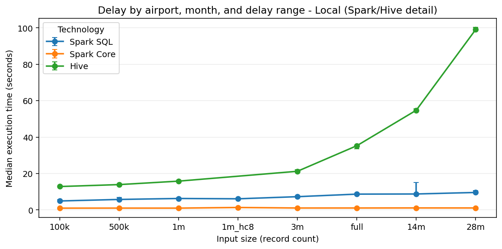
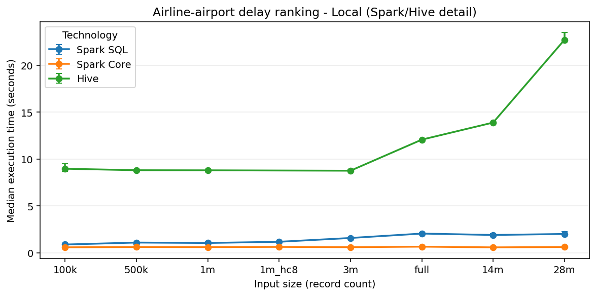
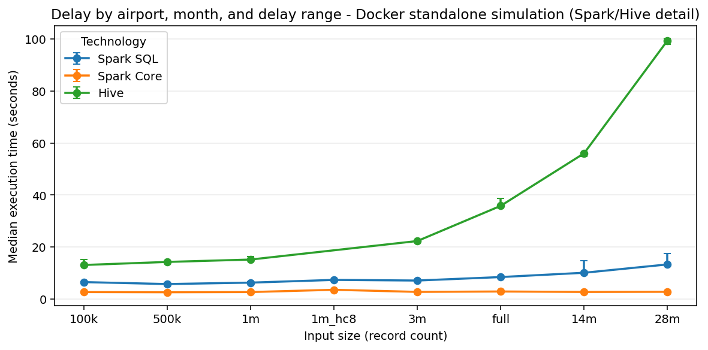
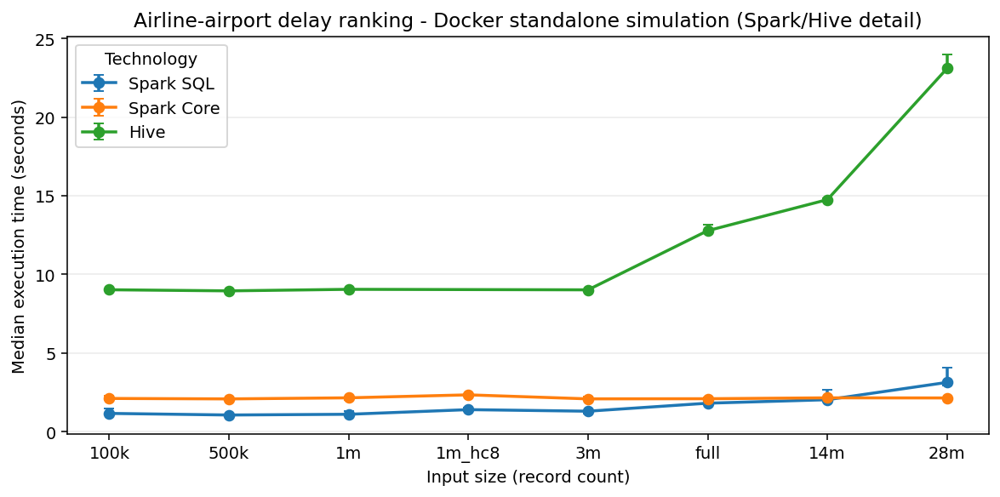

# Executive Summary

This project studies United States flight delays with a reproducible big-data pipeline spanning Spark SQL, Spark Core, Hive, and a MapReduce stretch implementation. The analytical jobs use the cleaned 7,079,081-row dataset; the benchmark ladder extends from `100k` to `28m` through deterministic subsets and controlled replication.

Repository: <https://github.com/Forest904/flight-delay-big-data-analysis.git>

The analytical outputs are intentionally compact. The first profiles departure and arrival delay behavior by origin airport, month, and delay band. The second ranks airline-airport pairs by average departure delay while reporting arrival delay, cancellation rate, airport average, and deviation from that airport average. Spark SQL is the reference implementation; Spark Core, Hive, and MapReduce outputs are checked against it where applicable.

The final benchmark dataset contains five local and Docker standalone simulation runs for Spark SQL, Spark Core, Hive, and MapReduce across the full ladder. AWS EMR larger-profile evidence contains three runs for Spark SQL and Spark Core across the same ladder, collected through `aws-3x-small`, `aws-3x-mid`, `aws-3x-14m`, and `aws-3x-28m`. Hive is reported as local and Docker evidence only, because the current EMR runner implements Spark steps but not Hive steps.

# Dataset And Outputs

The table below fixes the data source, prepared input, benchmark scale, and technology scope used throughout the report.

| Area | Final choice |
|---|---|
| Source domain | Kaggle 2024 U.S. flight-delay CSV |
| Raw shape | 7,079,081 rows and 35 columns |
| Prepared input | Cleaned parquet, 7,079,081 rows |
| Benchmark ladder | `100k`, `500k`, `1m`, `3m`, `full`, `14m`, `28m` |
| Stress inputs | `1m_hc8` cardinality stress; `14m`/`28m` row replication |
| Reference engine | Spark SQL |
| Comparison engines | Spark Core, Hive, MapReduce stretch |
| Main outputs | Delay-band report and airline-airport ranking |
| Evidence style | Generated tables, charts, and benchmark CSVs |

Preparation maps the raw CSV to a canonical schema, trims categorical fields, casts date and numeric columns, normalizes empty strings to nulls, and removes only structurally invalid rows. Cancelled, diverted, null-delay, and negative-delay rows are preserved because they affect denominators and delay distributions. The input manifest records subset and replication inputs.

The delay-band report groups by origin airport, month, and delay range, recording counts, average delays, and dominant cause fields. The ranking groups by origin airport and airline, reports delay and cancellation indicators, and ranks carriers by average departure delay.

# Implementations

The table below summarizes the role of each implementation path.

| Engine | Role | Notes |
|---|---|---|
| Spark SQL | Reference | Declarative query plan, compact logic, strongest optimizer support |
| Spark Core | Cross-check | Explicit transformations expose shuffle and aggregation costs |
| Hive | SQL comparison | Useful for warehouse-style execution in local and Docker batches |
| MapReduce | Stretch | Lower-level baseline; included where the runner completes |

Spark SQL is the clearest reference. Spark Core mirrors the logic with explicit transformations, Hive preserves a SQL-oriented path outside Spark, and MapReduce shows the cost of lower-level batch code. All technologies write comparable tabular outputs; generated first-10 files under `report/tables/` show schema alignment.

# Benchmark Evidence

All benchmark batches use the full ladder: `100k`, `500k`, `1m`, `3m`, `full`, `14m`, and `28m`. Local and Docker figures also show `1m_hc8`, a high-cardinality diagnostic stress input; the AWS campaign stays on the seven main labels.

The table below states which technologies and repetitions are represented in the final benchmark evidence.

| Environment | Technologies | Runs per cell |
|---|---|---:|
| Local | Spark SQL, Spark Core, Hive, MapReduce | 5 |
| Docker standalone simulation | Spark SQL, Spark Core, Hive, MapReduce | 5 |
| AWS EMR larger profile | Spark SQL, Spark Core | 3 |

The local and Docker batches establish repeatability on the development machine and inside the constrained standalone simulation. The AWS batch provides the distributed-cluster comparison on a 1 primary plus 3 core `m5.xlarge` EMR profile. AWS Hive is not claimed because the current EMR runner supports Spark steps only.

## Selected Medians

Full-input all-engine median runtimes, in seconds:

The table below compares the original prepared full input across all available engines. MapReduce is kept here once because the large gap is itself an important result; later comparisons focus on Spark and Hive readability.

| Env. | Tech. | Runs | Delay | Ranking |
|---|---|---:|---:|---:|
| Local | spark_sql | 5 | 8.67 | 2.06 |
| Local | spark_core | 5 | 1.04 | 0.67 |
| Local | hive | 5 | 35.25 | 12.08 |
| Local | mapreduce | 5 | 270.54 | 250.11 |
| Docker | spark_sql | 5 | 8.43 | 1.81 |
| Docker | spark_core | 5 | 2.88 | 2.09 |
| Docker | hive | 5 | 35.81 | 12.78 |
| Docker | mapreduce | 5 | 273.26 | 252.51 |
| AWS | spark_sql | 3 | 13.45 | 2.51 |
| AWS | spark_core | 3 | 1.87 | 0.83 |

Largest-input Spark/Hive median runtimes, in seconds:

The table below repeats the comparison for the largest available input in each environment, excluding MapReduce so the Spark and Hive differences stay legible.

| Env. | Tech. | Runs | Delay | Ranking |
|---|---|---:|---:|---:|
| Local | spark_sql | 5 | 9.58 | 2.02 |
| Local | spark_core | 5 | 1.06 | 0.63 |
| Local | hive | 5 | 99.06 | 22.72 |
| Docker | spark_sql | 5 | 13.28 | 3.13 |
| Docker | spark_core | 5 | 2.76 | 2.14 |
| Docker | hive | 5 | 99.36 | 23.10 |
| AWS | spark_sql | 3 | 23.96 | 4.99 |
| AWS | spark_core | 3 | 2.01 | 0.89 |

The strongest pattern is the gap between higher-level engines and the MapReduce stretch. Spark Core is the fastest measured path for these compact aggregations, Spark SQL remains concise and competitive, Hive is slower but stable, and Hadoop Streaming becomes expensive on large replicated inputs. AWS EMR is best read as managed-cluster evidence, not as a guaranteed speed win for this workload.

# Figures

The first chart keeps MapReduce visible once, so the reader can see the order-of-magnitude gap created by the Hadoop Streaming path.

The next chart removes MapReduce from the same local delay workload, making Spark SQL, Spark Core, and Hive differences readable.

The local ranking chart below uses the same Spark/Hive-only view for the second analytical job.

The Docker delay chart below shows the same Spark/Hive comparison inside the standalone simulation environment.

The Docker ranking chart below completes the Spark/Hive comparison for the second job.

The AWS delay chart below is Spark-only because the EMR campaign runner executes Spark SQL and Spark Core steps.

The final AWS chart shows the same Spark-only comparison for the ranking job.

## Why Spark Core Is Faster Here

Spark Core is faster in this benchmark because the selected jobs are compact aggregations with small final outputs, not broad exploratory SQL workloads. The RDD implementation reduces records directly into purpose-built accumulator objects with `reduceByKey`, then sorts only the already-small aggregate outputs needed for the report tables.

Spark SQL remains the cleaner reference, but its plans carry extra generality: SQL expression evaluation, temporary views, window/ranking operators, array construction for top causes, and DataFrame-to-Pandas materialization. For this specific pipeline, the hand-written Spark Core path avoids enough of that overhead to win consistently. This should not be read as a universal Spark Core advantage; more complex joins, wider transformations, or less carefully written RDD code could easily reverse the result.

# AWS EMR Evidence

The table below lists the four AWS run groups used to cover the full ladder while limiting the blast radius of any single EMR failure.

| Run ID | Inputs | Tech. | Reps |
|---|---|---|---:|
| `aws-3x-small` | `100k`, `500k`, `1m` | Spark SQL, Spark Core | 3 |
| `aws-3x-mid` | `3m`, `full` | Spark SQL, Spark Core | 3 |
| `aws-3x-14m` | `14m` | Spark SQL, Spark Core | 3 |
| `aws-3x-28m` | `28m` | Spark SQL, Spark Core | 3 |

The split AWS campaign reduced failure blast radius during the limited lab window while preserving one coherent AWS phase. Each group uploaded inputs and scripts, ran the EMR benchmark, fetched result CSVs, and cleaned up the cluster. The medians shown here are job-runtime medians; upload, step orchestration, fetch, and cleanup are documented in the run artifacts.

# Critical Discussion

The project confirms that implementation style and execution environment both matter. Spark SQL and Spark Core produce comparable results, but their runtime differences shift by environment and input size. Hive is expressive for these SQL-shaped aggregations, while MapReduce is the least ergonomic despite remaining a useful lower-level reference.

The benchmark ladder prevents a single-size conclusion. Small subsets emphasize startup and orchestration; mid-size inputs expose shuffle and aggregation behavior; the largest replicated inputs show whether fixed overhead has been amortized. AWS EMR provides clean cloud execution and headroom, but the measured workload is still shaped by S3 access, step execution, and compact final outputs.

# Limitations

The table below states the main boundaries of the evidence without weakening the validated local, Docker, and AWS Spark results.

| Limitation | Impact |
|---|---|
| AWS Hive not implemented | Hive evidence is limited to local and Docker standalone simulation |
| MapReduce stretch scope | Useful comparison, but less optimized than engine-native SQL paths |
| Single AWS cluster shape | Results show one EMR larger profile, not a full cluster-sizing study |
| Prepared input layout | Strongly influences Hive, Spark, and MapReduce runtime behavior |
| Replication stress inputs | Good for scaling pressure, but not a substitute for new real-world records |

The final results are therefore best interpreted as a controlled engineering comparison for this dataset and this pipeline, rather than a universal ranking of big-data technologies.

# Conclusion

The final pipeline is reproducible, multi-engine, and benchmarked across local, Docker standalone simulation, and AWS EMR larger-profile environments. Spark SQL remains the best reference because it is concise and maintainable; Spark Core confirms the same behavior with lower-level transformations. The practical result is not that one engine always wins, but that engine choice, environment overhead, input size, and output shape interact.

# Evidence Appendix

Spark SQL reference rows are shown below. First-10 files for Spark SQL, Spark Core, Hive, and MapReduce are stored under `report/tables/` using `first_10_<technology>_<job>.(csv|md)`.

## Delay-Band Output Sample

First 10 reference rows, metrics:

The table below shows the first ten Spark SQL delay-band metric rows after sorting.

| Origin | Mo. | Range | Flights | Dep. avg | Arr. avg |
|---|---:|---|---:|---:|---:|
| ABE | 1 | cancelled_no_departure_delay | 11 |  |  |
| ABE | 1 | low | 277 | -5.509 | -14.556 |
| ABE | 1 | medium | 31 | 34.323 | 32.500 |
| ABE | 1 | high | 30 | 241.300 | 234.033 |
| ABE | 2 | cancelled_no_departure_delay | 3 |  |  |
| ABE | 2 | low | 297 | -6.650 | -19.571 |
| ABE | 2 | medium | 20 | 29.700 | 10.105 |
| ABE | 2 | high | 14 | 227.929 | 217.929 |
| ABE | 3 | cancelled_no_departure_delay | 2 |  |  |
| ABE | 3 | low | 339 | -6.186 | -18.369 |

First 10 reference rows, leading causes:

The table below splits the cause fields away from the numeric metrics so the wide output remains readable.

| Origin | Mo. | Range | Cause 1 | Cause 2 | Cause 3 |
|---|---:|---|---|---|---|
| ABE | 1 | cancelled_no_departure_delay | cancellation:B 11 |  |  |
| ABE | 1 | low | unknown 256 | delay:nas 20 | delay:carrier 1 |
| ABE | 1 | medium | delay:late_aircraft 12 | delay:carrier 8 | unknown 7 |
| ABE | 1 | high | delay:late_aircraft 14 | delay:carrier 12 | delay:nas 2 |
| ABE | 2 | cancelled_no_departure_delay | cancellation:B 3 |  |  |
| ABE | 2 | low | unknown 285 | delay:nas 10 | delay:carrier 1 |
| ABE | 2 | medium | unknown 12 | delay:carrier 5 | delay:late_aircraft 3 |
| ABE | 2 | high | delay:carrier 6 | delay:late_aircraft 6 | delay:nas 1 |
| ABE | 3 | cancelled_no_departure_delay | cancellation:B 1 | cancellation:C 1 |  |
| ABE | 3 | low | unknown 332 | delay:nas 7 |  |

## Airline-Airport Ranking Sample

First 10 reference rows:

The table below shows the first ten Spark SQL airline-airport ranking rows. `Delta` is the airline average departure delay minus the airport average.

| Origin | Air | N | Dep | Arr | Canc | Airport | Delta | Rank |
|---|---|---:|---:|---:|---:|---:|---:|---:|
| ABE | G4 | 1839 | 8.431 | 0.643 | 0.016 | 12.160 | -3.728 | 1 |
| ABE | 9E | 1017 | 9.418 | 0.669 | 0.014 | 12.160 | -2.742 | 2 |
| ABE | OH | 1166 | 15.546 | 4.446 | 0.013 | 12.160 | 3.387 | 3 |
| ABE | OO | 315 | 30.630 | 22.308 | 0.038 | 12.160 | 18.471 | 4 |
| ABI | MQ | 1757 | 7.310 | 4.410 | 0.009 | 7.310 | 0.000 | 1 |
| ABQ | DL | 1547 | 1.746 | -5.603 | 0.009 | 9.467 | -7.721 | 1 |
| ABQ | OO | 3987 | 2.103 | -2.051 | 0.005 | 9.467 | -7.365 | 2 |
| ABQ | MQ | 907 | 5.284 | 3.258 | 0.007 | 9.467 | -4.183 | 3 |
| ABQ | UA | 1822 | 5.488 | -0.321 | 0.010 | 9.467 | -3.979 | 4 |
| ABQ | AS | 423 | 8.402 | 4.526 | 0.009 | 9.467 | -1.065 | 5 |
